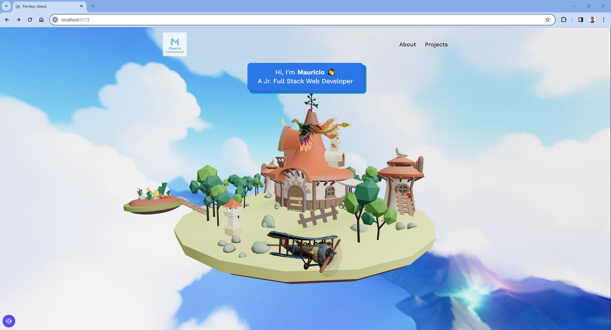

# Fantasy Island

Fantasy Island es un proyecto fascinante que te transporta a un mundo virtual lleno de maravillas y aventuras. Sumérgete en un entorno visualmente impresionante, donde una isla mágica, un biplano y un cielo dinámico se combinan para crear una experiencia envolvente.

## Iconos

Características notables:

:star: Ambiente Encantador: Explora una isla encantada con detalles artísticos y escenarios cautivadores que te sumergirán en un mundo de fantasía. 🏝️

:star: Interactividad: Controla el movimiento de la isla y el biplano mientras experimentas una sensación única de exploración y descubrimiento.🎮

:star: Música Atmosférica: Disfruta de una banda sonora envolvente que acompaña tu viaje, creando una atmósfera mágica y emocional. 🎵

:star: Diseño Responsivo: La aplicación se adapta de manera elegante a diferentes tamaños de pantalla, ofreciendo una experiencia óptima tanto en dispositivos móviles como en ordenadores. 📱💻

:star: Estilo Artístico Único: Las representaciones visuales únicas, desde el vuelo del biplano hasta la isla en rotación, crean una experiencia estética que destaca por su originalidad. 🎨


...

## Espacio

A continuación, una muestra:



## Instalación

Instrucciones para instalar y ejecutar tu proyecto.

```bash
# Clona el repositorio
git clone https://github.com/m4ur7/Fantasy-Island.git

# Instala las dependencias
npm install
